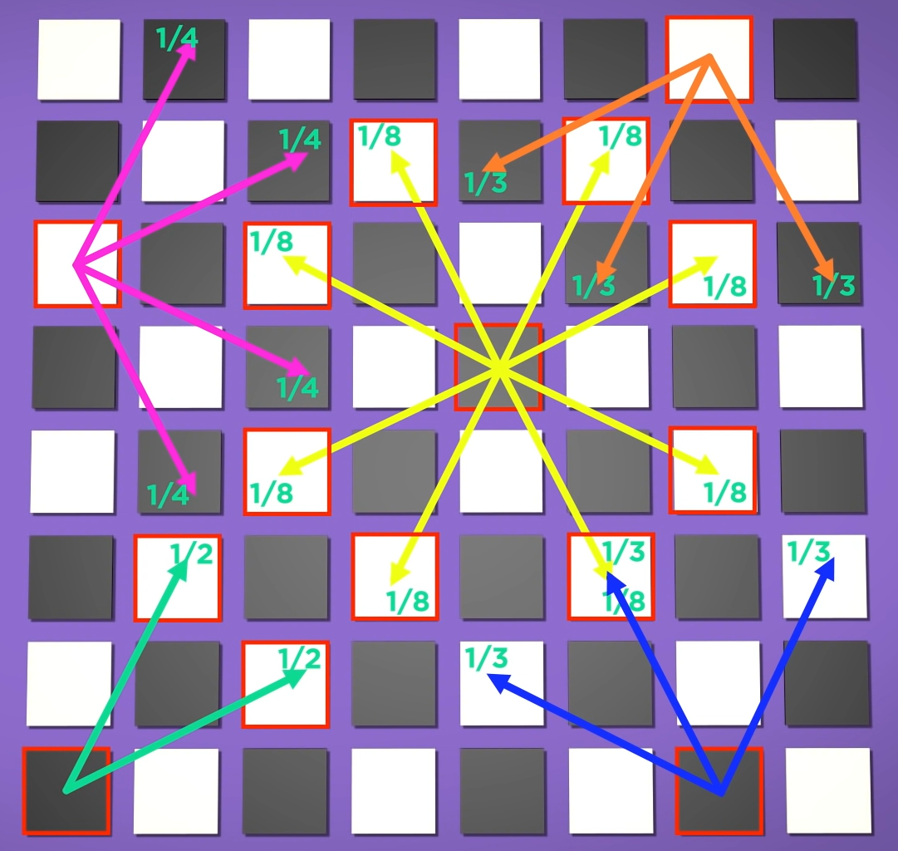
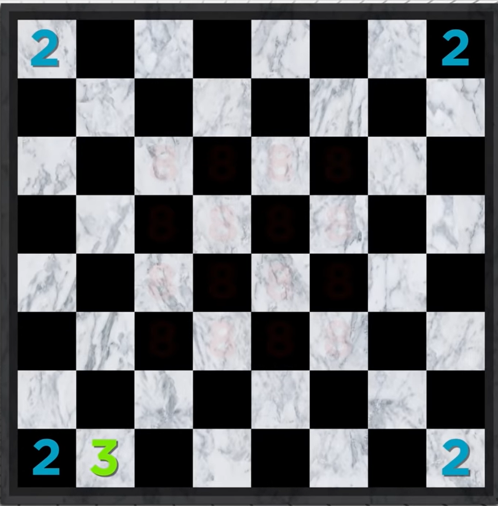
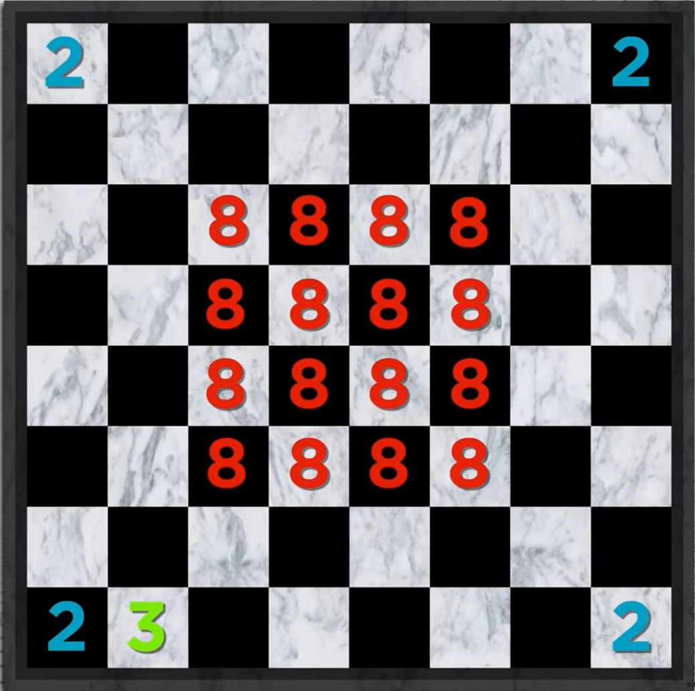
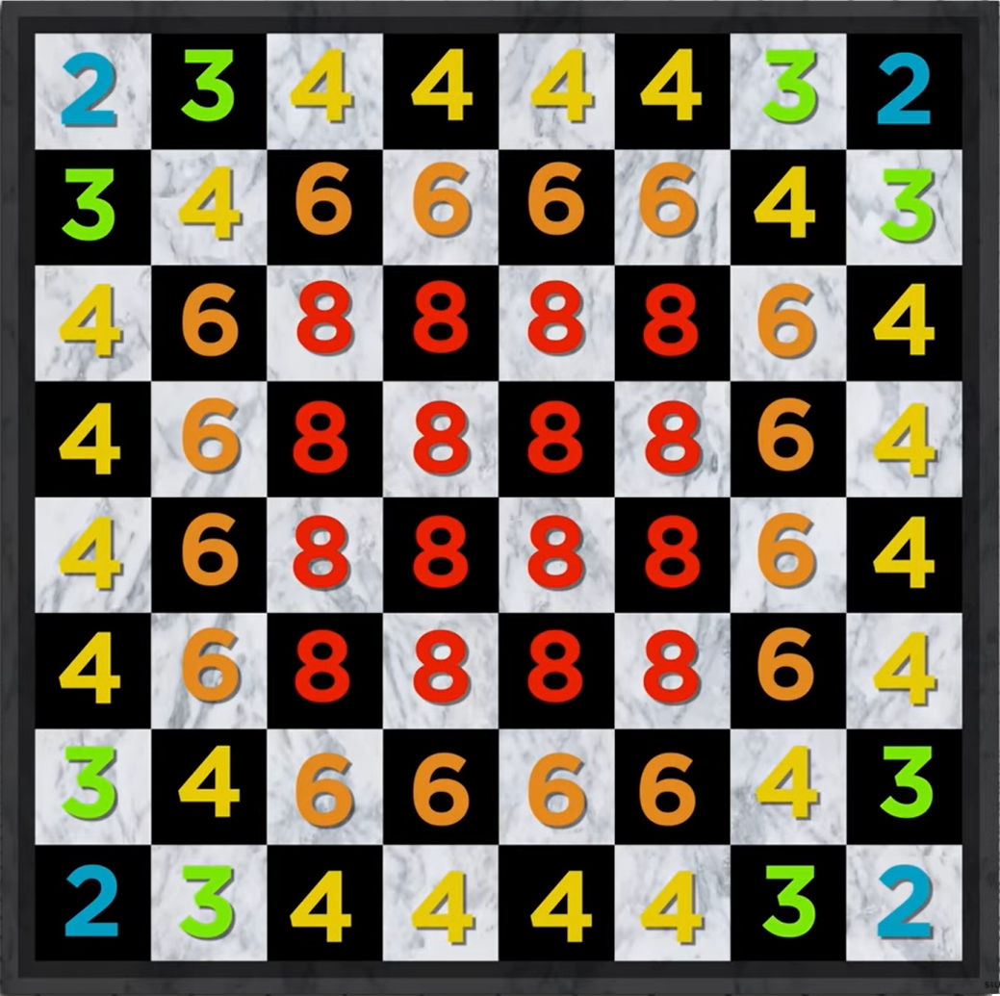
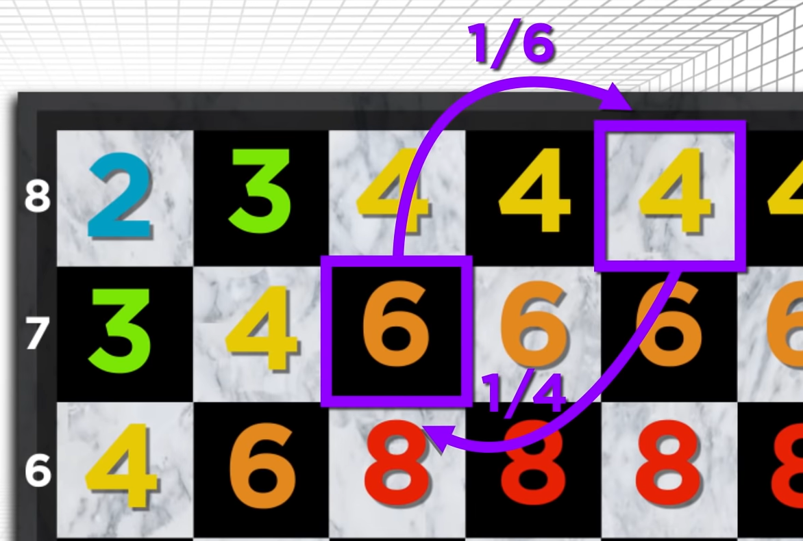
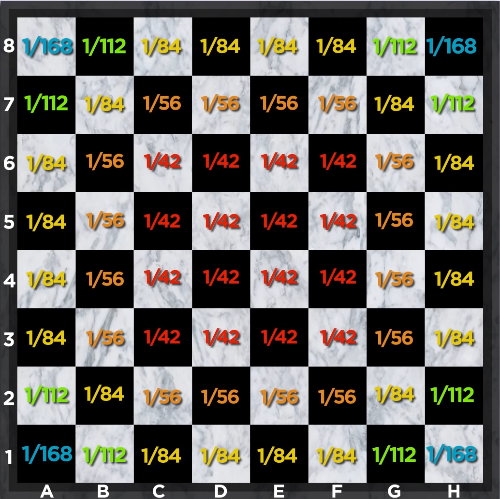
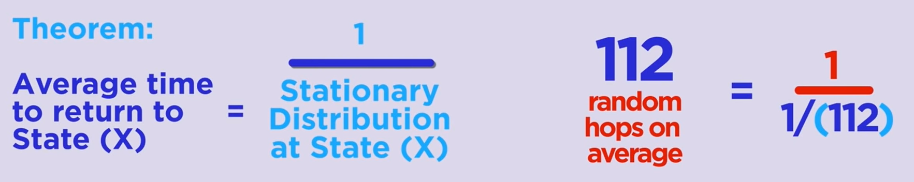

# Wstęp do rachunku prawdopodobieństwa - Łańcuchy Markowa
Tematem projektu, który wybrałem są Łańcuchy Markowa. Zdecydowałem się zgłębić to zagadnienie w kontekście szachów.
## Projekt - Wykonanie
Projekt został wykonany w formie strony internetowej. Całość została zrealizowana za pomocą HTML, CSS oraz JavaScript.
## Projekt - Działanie
Przede wszystkim zależało mi na tym, żeby w stosunkowo interesujący sposób zestawić ze sobą matematyczny rezultat z prawdziwym przypadkiem, dlatego aplikacja przede wszystkim opiera się na przeprowadzeniu symulacji wędrówki bierki szachowej po pustej szachownicy do momentu aż nie wróci do początkowego stanu.

Funkcjonalności:

Wchodząc na stronę widzimy szachownicę, a pod nią 5 bierek (król, hetman, wieża, goniec, skoczek). Pod bierkami znajdują się trzy przyciski oraz niewielki panel dotyczący symulacji. Aby skorzystać z jakiejkolwiek funkcjonalności musimy przeciągnąć bierkę, która nas interesuje na szachownicę. Jest to mechanizm drag and drop, zatem łapiemy bierkę, przeciągamy na miejsce, w którym chcemy żeby się znalazła i puszczamy.

Jeśli upuścimy bierkę na szachownicy, dolny panel z bierkami zniknie - możemy mieć tylko jedną bierkę na szachownicy w danym momencie. 
Jeśli chcemy zmienić pozycje bierki, bez problemu możemy to zrealizować w taki sam sposób - łapiemy i przeciągamy na nowe miejsce.
Jeśli chcemy zmienić kompletnie bierkę, wystarczy że przesuniemy ją poza szachownicę, wtedy panel z bierkami pojawi się ponownie i możemy ustawić nową bierkę.

Gdy upuścimy już bierkę na szachownicy, wszystkie trzy przyciski staną się aktywne, ale przede wszystkim zmienić się wartość w panelu symulacji w prawym dolnym rogu.

W zależności od miejsca gdzie i jaka bierka zostanie upuszczona, zostanie policzone po ile ruchach średnio bierka powinna wrócić do tego miejsca gdyby zaczęła w tym momencie błądzić (tj. wykonywać losowe posunięcia).

Mając bierkę na stole pojawia się również przycisk "Clear", który służy do przywrócenia stanu początkowego aplikacji.

Przycisk "Number of moves" narysuje na szachownicy liczbę dostępnych ruchów z każdego pola jakie może wykonać bierka w zależności od tego jaką postawiliśmy na szachownicy.

Przycisk "Stationary distribution" narysuje na szachownicy rozkład stacjonarny (dla każdego stanu), czyli pojawi ułamek odpowiadający wartości rozkładu stacjonarnego dla danego stanu.

Przycisk "Start simulation" uruchomi symulację gdzie pozycją startową będzie kwadrat, na którym stoi bierka. W panelu symulacji zliczane będą kolejne ruchy wykonane przez bierkę, oprócz tego możemy w każdej chwili manipulować prędkością przemieszczeania się bierki suwakiem (min. opóźnienie 1ms, maksymalne 5000 ms). Kwadrat początkowy przez cały czas trwania symulacji będzie podświetlony na czerwony kolor, zaś kwadrat do którego bierka się przemieszcza będzie otrzymywał żołtą ramkę. Symulacja trwa dopóki bierka nie wróci do swojego początkowego stanu.
W konsoli programistycznej (F12) można podglądać informacje, które są w danej chwili przetwarzane/obliczane.
## Projekt - podłoże teoretyczne
Niezbędnym składnikiem do rozpoczęcia jakichkolwiek rozważań przy temacie Łańcuchów Markowa jest przestrzeń stanów. Niezależnie od tego nad czym konkretnie będziemy się
zastanawiać, musimy ją określic. W przypadku tematyki mojego projektu, przestrzenią stanów jest cała szachownica.

Każdy kwadrat reprezentuje jeden z 64 stanów.

Kolejnym składnikiem, bez którego rozważania nie miałyby sensu jest funkcja przejścia albo macierz przejścia, z której możemy odczytać
prawdopodobieństwo przejścia z jednego stanu do drugiego. W zależności od tego nad czym konkretnie będziemy się zastanawiać, macierz przejścia będzie inna.
Gdybyśmy chcieli wyznaczyć taką funkcję przejścia prawdopodobieństwa, zaczęlibyśmy rysować z każdego kwadratu (każdego stanu) strzałki do innych kwadratów, do których mamy
możliwość przemieszczenia się. W zależności od tego jaką bierką byśmy się poruszali, strzałki byłyby inaczej kierowane, jednak koniec końcow na pewno wyszedłby nam jeden wielki
bazgroł. Dlatego czytelniejszą formą byłaby na pewno macierz przejścia, przy czym musiałaby ona być rozmiarów 64 x 64, a więc całkiem spora. 
Przy typowym podejściu do określania czasu powrotu do stanu, macierz przejścia byłaby przydatna, ponieważ to za jej pomocą średni czas zostałby policzony - w projekcie jednak korzystam z innego podejścia.

Jednak w jaki sposób obliczyć po ilu ruchach, średnio, bierka szachowa postawiona na którymś z kwadratów, wróci na to samo miejsce?
Najpierw trzeba zliczyć dla każdego kwadratu na jakim potencjalnie może znaleźc się bierka, ile dozwolonych i unikatowych ruchów może dana bierka z tego kwadratu wykonać.
Krótko mówiąc, układamy bierkę na każdym kwadracie, sprawdzamy ile ruchów możemy wykonać, zapisujemy liczbę na tym kwadracie i idziemy dalej. Na przykładzie skoczka wyglądałoby to tak, że:

- skoczek postawiony w rogach szachownicy (4 takie stany) może wykonać tylko 2 możliwe ruchy

- skoczek postawiony w centrum szachownicy (środkowy kwadrat 4 x 4) może przemieścić się już na jedno z 8 możliwych pól

- kontynując zliczanie w ten sposób, uzyskamy szachownicę, która powinna wyglądać podobnie do tej:

Realizację tego etapu można uzyskać poprzez kliknięcie przycisku "Number of moves" w aplikacji.

Następnym krokiem jest zauważenie kluczowej zależności dla szachowej przestrzeni stanów:

Jeśli wszystkie skoczki wykonują jeden, losowy ruch, wtedy średnio liczba skoczków, które znajdą się na danym polu jest równa liczbie, która znajduje się na danym kwadracie na powyższym rysunku.

Przeanalizujmy to stwierdzenie na podstawie pól C7 i E8.

Wszystkie skoczki znajdujące się na polach przemieszczają się losowo. Na C7 jest sześć skoczków, zaś na E8 są cztery. Każdy skoczek znajdujący się na polu C7 ma 1/6 szansy na przeskoczenie na pole E8 (zgodnie z tym co zostało wcześniej powiedziane). Tak samo każdy z czterech skoczków stojących na E8 ma 1/4 szansy na znalezienie się na polu C7 po wykonaniu ruchu.

W takim wypadku można powiedzieć, że średnio jeden skoczek z C7 powinien przemieścić się na E8 i tak samo średnio jeden z E8 powinien przemieścić się na C7. I w takim przypadku skoczki zamieniają się miejscami więc tak naprawdę sytuacja na szachownicy pozostaje taka sama.
Sytuacja taka zachodzi między wszystkimi kwadratami, które dzieli jeden ruch skoczka.

Mając wcześniejszą szachownicę wypełnioną liczbą ruchów dostępnych z danego kwadratu, jest już bardzo blisko do uzyskania rozkładu stacjonarnego.
W tym przypadku potrzebujemy liczbę wszystkich skoczków, czyli sumę cyfr z każdego kwadratu z poprzedniego obrazka. Wynikiem jest 336 wszystkich skoczków.
Teraz wystarczy podzielić liczbę z każdego kwadratu przez 336, aby otrzymać ułamek i zmienić szachownicę w odzwierciedlenie rozkładu stacjonarnego.

Realizację tego etapu można uzyskać poprzez kliknięcie przycisku "Stationary distribution" w aplikacji.

Posiadając już rozkładu stacjonarny, można zastosować twierdzenie, mówiące, że średni czas powrotu to stanu X wynosi 1 podzielone przez wartość rozkładu stacjonarnego w stanie X.
Zatem dla skoczka znajdującego się na swoim domyślny miejscu (B1), który ma 3 legalne ruchy do wykonania, rozkład stacjonarny wynosi 1 podzielone przez (3/336) czyli 1/(1/112), czyli 112.
Liczba, która wyszła to średni czas powrotu skoczka do swojego początkowego stanu. Oczywiście jest to tylko jakiś punkt zaczepienia, ponieważ jak sama symulacja pokazuje, skoczek wróci czasami po 2 ruchach - a czasami będzie skakać zdecydowanie więcej razy niż 112. Zakładając teraz, że ruch jest wykonywany z określoną prędkością np. 1 ruch na 1 sekundę, można określic po jakim czasie bierka szachowa wróci do swojego stanu początkowego.

Aplikacja pozwala na ustawienie dowolnej bierki w dowolnym miejscu, sprawdzenie ile średnio ruchów zająłby powrót, na podstawie rozkładu stacjonarnego można się spodziewać, które pola są częściej okupowane i jak powinien zmieniać się czas powrotu tj. do których pól średnio szybciej się wróci niż do innych.

## Goniec
W przypadku Gońca należy zwrócić uwagę, że jako przestrzeń stanów traktuje się 32 pola, po których goniec może się poruszać. W takim ujęciu wszystko działa w sposób analogiczny, a jako sumę gońców ze wszystkich pól bierzę się połowę.

## Podłoże teoretyczne - mniej skrótowo, bardziej dowodowo
W początkowej fazie realizacji projektu zdałem sobie sprawę, że wziąłem niejako na wiarę dwie rzeczy:

a) Po pierwsze to, że w celu uzyskania rozkładu stacjonarnego możemy skorzystać z liczby ruchów z danego pola i po prostu podzielić ją przez sumę tych ruchów ze wszystkich pól. Tłumaczenie, które odnalazłem w filmie, który był głównem źródłem inspiracji do stworzenia projektu, trafiło do mnie i nie zastanawiałem się nad tym głębiej dlaczego w tak prosty sposób można uzyskać rozkład stacjonarny skoro często jest to zdecydowanie bardziej wymagający proces - a tutaj prawie w ogóle nie ma liczenia.

b) Po drugie to, że w celu uzyskania średniego oczekiwanego czasu powrotu do stanu początkowego, można skorzystać z twierdzenia, że wynosi on 1 przez wartość rozkładu stacjonarnego w stanie dla, którego to liczymy.

Po czasie stwierdziłem jednak, że chciałbym zobaczyć dlaczego oba zjawiska mają rację bytu i zaczęło mnie to po prostu ciekawić. W polskich źródłach nie mogłem znaleźć satysfakcjonujących mnie odpowiedzi, paradoksalnie były one dla mnie mniej zrozumiałe niż te zagraniczne, ale po czasie spędzonym na czytaniu miałem pewność, że te dwie rzeczy, o których napisałem rzeczywiście mają poparcie w matematyce - nie rozumiałem jeszcze tylko dlaczego. Z pełną świadomością, że prawdopodobnie tak czy siak tego nie zrozumiem, szukałem dalej.

Inspiracją dla stworzenia całego projektu jest filmik na który natknąłem się na YouTube:

https://www.youtube.com/watch?v=63HHmjlh794&t=605s

umieszczony na kanale PBS Infinite Series

Grafiki, które zostały wykorzystane w tym dokumencie pochodzą z powyższego materiału, który był punktem wyjścia dla całej wiedzy nabywanej dalej w celu zgłębienia zagadnienia.

Materiały i źródła pomocnicze:

https://people.math.wisc.edu/~valko/courses/331/MC3.pdf

https://math.stackexchange.com/questions/1129060/expected-first-return-time-of-markov-chain

http://tomasz.home.amu.edu.pl/wrp/mat10.pdf

http://wazniak.mimuw.edu.pl/index.php?title=Rachunek_prawdopodobie%C5%84stwa_i_statystyka/Wyk%C5%82ad_10:_%C5%81a%C5%84cuchy_Markowa#Ergodyczno.C5.9B.C4.87

http://statystyka.rezolwenta.eu.org/Materialy/Markowa.pdf

Materiały z wykładu
